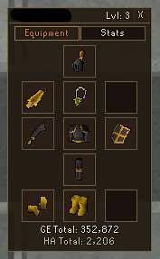
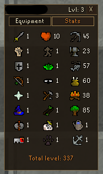
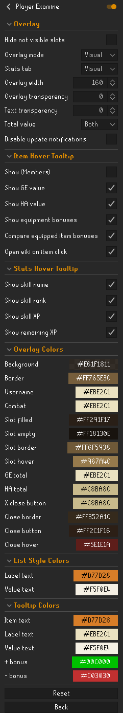

# Player Examine

RS3-inspired player examine overlay for RuneLite.

Player Examine turns player examines into a compact, configurable overlay for checking equipment, values, bonuses, and hiscore stats without leaving the game view. It supports multiple display styles, detailed hover tooltips, and a stats tab that mirrors the OSRS skills layout.

<table>
  <tr>
    <td valign="top">
      
    </td>
    <td valign="top">
      
    </td>
  </tr>
</table>

## Features

- Adds a right-click `Examine` option for other players
- Opens a movable overlay after examining a player
- Supports `Visual`, `List`, and `Hybrid` equipment layouts
- Supports an optional stats tab with visual or list-style display
- Shows item hover tooltips with GE value, HA value, equipment bonuses, compare deltas, and wiki links
- Shows stats hover tooltips with skill name, rank, experience, and remaining XP
- Supports total value display in the overlay footer
- Supports hiding slots marked `Not visible from examine`
- Includes configurable overlay width, transparency, and text colors
- Includes separate color groups for overlay, list-style rows, item hover tooltips, and stats hover tooltips
- Includes login update notifications

## Configuration

